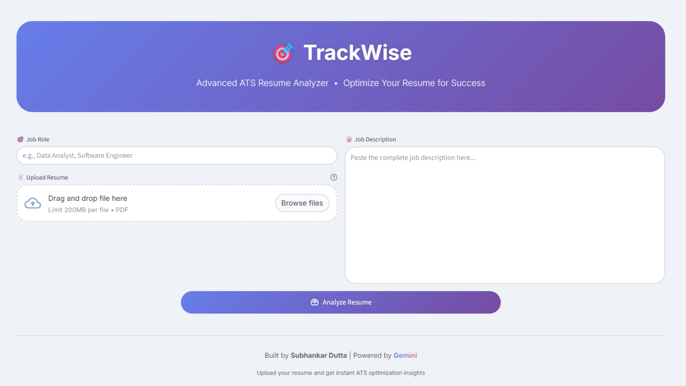

# TrackWise 🎯

**Advanced ATS Resume Analyzer** &mdash;
Optimize your resume for job applications using AI-powered analysis.



---

## 🚀 Features

* Upload your resume (PDF)
* Paste the job description
* Get an instant ATS Match Score (0-100)
* Identify:  
  * Strengths and weaknesses
  * Missing keywords
  * Technical skill match
  * Experience & education relevance
* Actionable improvement suggestions and recommendations

---

## 📂 Built With

* [Streamlit](https://streamlit.io/) - Frontend and app framework
* [LangChain](https://www.langchain.com/) - Prompt chaining
* [Google Gemini API](https://ai.google.dev/) - AI resume analysis
* [PyPDF](https://pypi.org/project/pypdf/) - PDF text extraction
* [Pydantic](https://docs.pydantic.dev/) - Data validation

---

## 📝 How to Run Locally

### 1. Clone the repo

```bash
git clone https://github.com/yourusername/trackwise.git
cd trackwise
```

### 2. Set up virtual environment (optional but recommended)

```bash
python -m venv venv
source venv/bin/activate  # On Windows: venv\Scripts\activate
```

### 3. Install dependencies

```bash
pip install -r requirements.txt
```

### 4. Add your Gemini API key

Create a `.streamlit/secrets.toml` file:

```toml
GEMINI_API_KEY = "your_gemini_api_key_here"
```

### 5. Run the app

```bash
streamlit run app.py
```

---

## 🎓 Project Structure

```
.
├── app.py              # Main Streamlit app
├── style.css           # Custom styling
├── preview.png         # UI screenshot
└── .streamlit
    └── secrets.toml    # API key (not tracked)
```

---

## 🚨 Notes

* Resume file must be in **PDF** format
* Analysis works best with detailed job descriptions
* API key is **required** to access Gemini model

---

## 🌟 Demo

**Live demo:** https://trackwise.streamlit.app/

---

## 👨‍💼 Author

[**Subhankar Dutta**](https://subhankar-dutta.streamlit.app)

---

## 🛌 License

MIT License. See `LICENSE` file for details.

---

## 🎨 UI Design Highlights

* Custom CSS for branding & layout
* Gradient headers, rounded containers, animated score display
* Responsive and minimal interface

---

Feel free to fork, use, or contribute!

> Built with passion to help job seekers land interviews faster.
